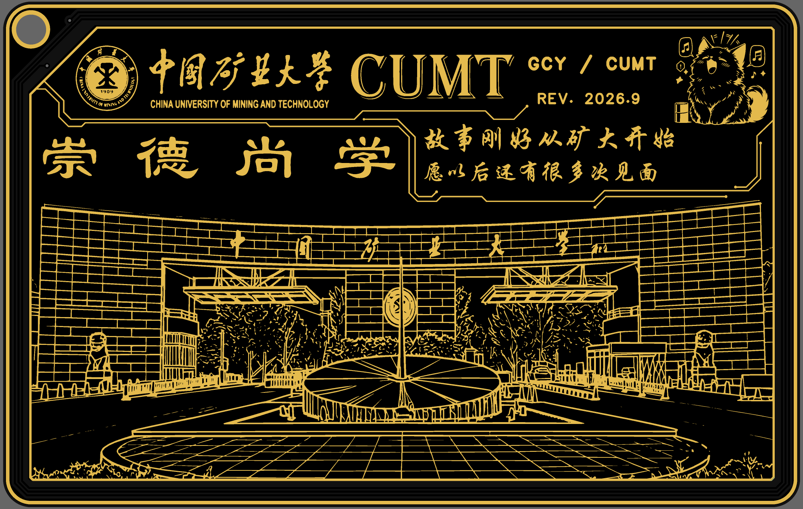
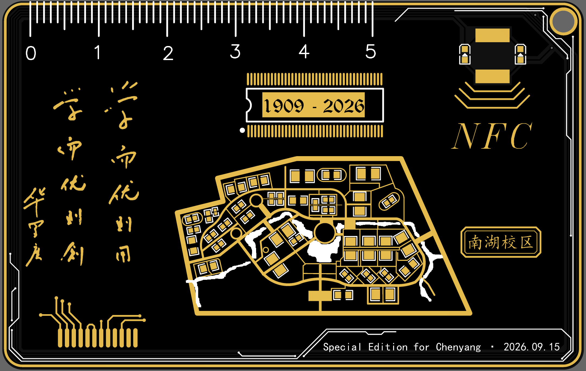
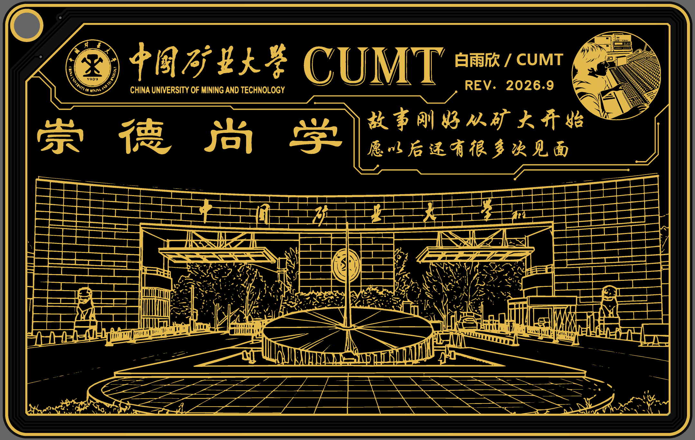

# 给 Chenyang 的校园卡纪念礼物

这是一张以中国矿业大学南湖校区为主题、用嘉立创 EDA 设计的定制 PCB 校园卡。
它保留了校园卡的科技感，也把校园里值得记住的风景和一份刚刚开始的认识，放进了金黑色的电路板里。

## 想送给你的话

推荐替换设计中原有的两句话：

> 很高兴在矿大认识你
>
> 期待下次再见面

第一句回应了我们相识的地点，也表达了真诚的开心；第二句温和地传达了想继续了解你的心意，但不预设关系，也不会让这份礼物显得有压力。

## 设计说明

- **金黑配色**：以 PCB 的阻焊层和金色走线为灵感，呈现克制、清晰的科技感。
- **矿大元素**：正面加入中国矿业大学校徽、CUMT 字样、南湖校区建筑线稿和校园场景。
- **专属信息**：保留 Chenyang 的英文名缩写与定制版本标识，让这张卡只属于你。
- **校园地图**：背面用电阻盘与导线抽象摆出南湖校区的大致布局，由同学高晨阳完成设计构思。
- **纪念属性**：卡片上的 `1909 - 2026` 记录学校的历史与当下，`REV. 2026.9` 代表这份礼物诞生的时间。

## 预览图

### Chenyang 定制版

| 正面                                                                                 | 背面                                                                                 |
| ------------------------------------------------------------------------------------ | ------------------------------------------------------------------------------------ |
|  |  |

### BYX 版本

| 正面                                                                        | 背面                                                                            |
| --------------------------------------------------------------------------- | ------------------------------------------------------------------------------- |
|  |  |

## 这份礼物的心意

我们昨天才认识，所以我没有把它做成一句需要回答的告白，也没有把未来写得太满。
我只是觉得，初次遇见就值得被认真记下来，于是把矿大、南湖校区和这次相识，做成一张可以留在身边的小小纪念卡。

希望你收到它时，感受到的是惊喜和轻松；也希望以后有机会，慢慢认识彼此，留下更多属于我们的校园记忆。

## 项目文件

- `ProPrj_矿大PCB校园卡nfc_GCY.epro2`：Chenyang 定制版本
- `ProPrj_矿大PCB校园卡nfc_BYX.epro2`：另一版项目文件
- `photo/GCY/`：Chenyang 版本的正反面预览图
- `photo/BYX/`：另一版正反面预览图
- `Gerber_PCB1_GCY.zip`、`Gerber_PCB1_GCY_2.zip`：GCY 版本 Gerber 文件
- `Gerber_PCB1_BYX.zip`、`Gerber_PCB1_BYX_2.zip`：BYX 版本 Gerber 文件

## 工具

- 嘉立创 EDA
- PCB 金黑工艺效果
- 电阻盘与导线地图结构
